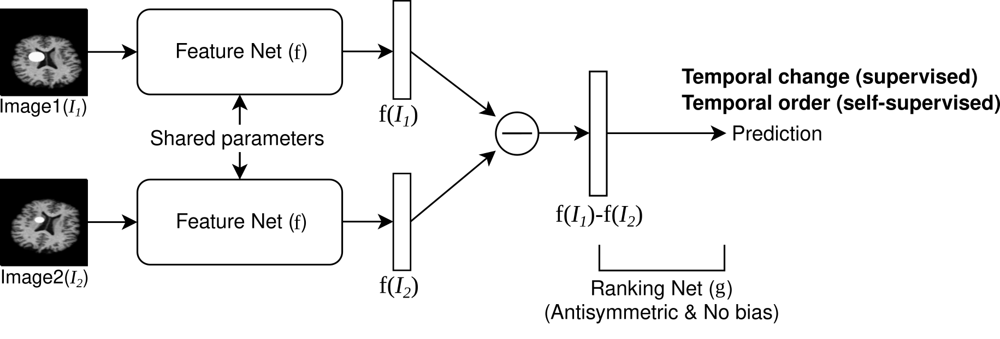

# Learning to compare longitudinal images
Implementation of the paper "Learning to compare longitudinal images" of Heejong Kim and Mert Sabuncu, to appear in MIDL 2023.

[comment]: <> ([Project Page]&#40;https://heejongkim.com/dwi-synthesis&#41; | [Paper]&#40;https://arxiv.org/abs/2106.13188&#41; )



[comment]: <> (TODO: update figure to a video of tumor size detection)

## Dependencies 
```shell
conda env create -f environment.yml
conda activate pairnet
```


## Instructions
We provide an example script and dataset of synthetic tumor. The script includes training and experiments (weighted CAM and correlation).
```shell script
bash example-script-tumor.sh
```


## Citation
If you use this code, please consider citing our work:
```
To be added
```
